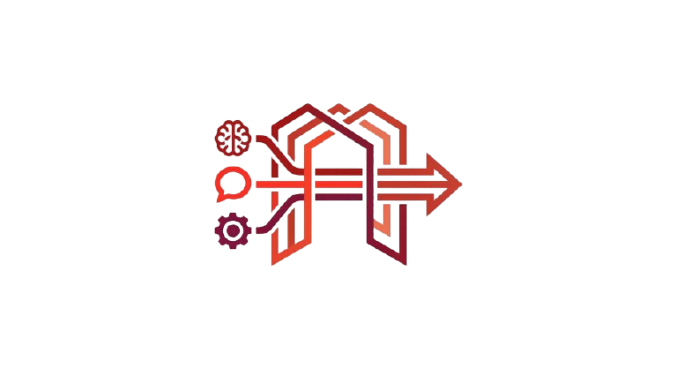

<p align="center">
  
</p>

<h1 align="center">LLMs2API</h1>

<p align="center">
  OpenAI-compatible API gateway for ChatGPT, DeepSeek, Qwen & Claude using browser automation
</p>

A unified OpenAI-compatible API gateway for multiple AI chat services including **ChatGPT**, **DeepSeek**, **Qwen**, and **Claude**.

This solution enables seamless integration with popular AI platforms through a standardized REST API interface, leveraging browser automation to interact with web-based chat interfaces.

---

## Overview

This project provides local API servers that expose OpenAI-compatible endpoints for various AI chat services. By utilizing Playwright for browser automation, it captures real-time streaming responses and delivers them through a familiar API format.

### Key Features

- **OpenAI-Compatible API** - Drop-in replacement for OpenAI SDK integrations
- **Multi-Provider Support** - ChatGPT, DeepSeek, Qwen, and Claude in one solution
- **Real-Time Streaming** - Server-Sent Events (SSE) support for streaming responses
- **Concurrent Request Handling** - Dynamic page pool supporting up to 10 parallel requests
- **Session Persistence** - Automatic browser state management for seamless authentication
- **Stateless Architecture** - Each request initiates a fresh conversation

---

## Architecture

```
┌──────────────────┐     ┌──────────────────┐     ┌──────────────────┐
│   Application    │────▶│   API Gateway    │────▶│  Browser Engine  │
│  (Your Client)   │     │   (Node.js)      │     │   (Playwright)   │
└──────────────────┘     └──────────────────┘     └──────────────────┘
                                                           │
                                                           ▼
                                                  ┌──────────────────┐
                                                  │   AI Platform    │
                                                  │ (ChatGPT, etc.)  │
                                                  └──────────────────┘
```

The gateway intercepts network traffic to capture streaming responses directly, ensuring accurate and efficient data transmission.

---

## Project Structure

```
├── chatgpt/               # ChatGPT Gateway (Port 3003)
│   ├── server.js
│   ├── package.json
│   └── browser-state.json
│
├── deepseek/              # DeepSeek Gateway (Port 3000)
│   ├── server.js
│   ├── package.json
│   └── browser-state.json
│
├── qwen/                  # Qwen Gateway (Port 3001)
│   ├── server.js
│   ├── package.json
│   └── browser-state.json
│
├── claude/                # Claude Gateway (Port 3002)
│   ├── server.js
│   ├── package.json
│   └── browser-state.json
│
└── README.md
```

---

## Installation

### Prerequisites

- Node.js 18.x or higher
- Chromium browser (automatically installed by Playwright)

### Setup

Navigate to the desired provider directory and install dependencies:

```bash
cd chatgpt  # or deepseek, qwen, claude
npm install
```

### Launch

```bash
node server.js
```

> **Note:** On first launch, a browser window will open for authentication. Complete the login process manually. Session credentials are automatically persisted for subsequent runs.

---

## Service Configuration

| Provider | Port | API Key | Base URL |
|----------|------|---------|----------|
| ChatGPT | 3003 | `sk-chatgpt` | `http://localhost:3003/v1` |
| DeepSeek | 3000 | `sk-deepseek` | `http://localhost:3000/v1` |
| Qwen | 3001 | `sk-qwen` | `http://localhost:3001/v1` |
| Claude | 3002 | `sk-claude` | `http://localhost:3002/v1` |

---

## API Reference

### Endpoints

| Method | Endpoint | Description |
|--------|----------|-------------|
| GET | `/health` | Service health check |
| GET | `/v1/models` | List available models |
| POST | `/v1/chat/completions` | Generate chat completion |
| POST | `/v1/images/generations` | Generate image (Qwen only) |

### Available Models

**ChatGPT**
| Model ID | Description |
|----------|-------------|
| `gpt-5.1` | GPT-5.1 (Default) |

**DeepSeek**
| Model ID | Description |
|----------|-------------|
| `deepseek-v3.2` | Standard model |
| `deepseek-v3.2-thinking` | Enhanced reasoning mode |
| `deepseek-v3.2-search` | Web search enabled |
| `deepseek-v3.2-thinking-search` | Reasoning + Search |

**Qwen**
| Model ID | Description |
|----------|-------------|
| `qwen3-max` | Standard model |
| `qwen3-max-thinking` | Enhanced reasoning mode |
| `qwen3-max-search` | Web search enabled |
| `qwen3-max-thinking-search` | Reasoning + Search |
| `qwen3-image` | Image generation |
| `qwen3-coder` | Code-optimized model |
| `qwen3-vl-235b` | Vision-language model (235B) |
| `qwen3-vl-32b` | Vision-language model (32B) |

**Claude**
| Model ID | Description |
|----------|-------------|
| `claude-sonnet-4.5` | Claude Sonnet 4.5 |
| `claude-haiku-4.5` | Claude Haiku 4.5 |

---

## Usage Examples

### Python (OpenAI SDK)

```python
from openai import OpenAI

# Initialize client
client = OpenAI(
    base_url="http://localhost:3003/v1",
    api_key="sk-chatgpt"
)

# Standard completion
response = client.chat.completions.create(
    model="gpt-5.1",
    messages=[
        {"role": "user", "content": "Explain quantum computing"}
    ]
)
print(response.choices[0].message.content)

# Streaming completion
stream = client.chat.completions.create(
    model="gpt-5.1",
    messages=[{"role": "user", "content": "Write a short story"}],
    stream=True
)
for chunk in stream:
    if chunk.choices[0].delta.content:
        print(chunk.choices[0].delta.content, end="", flush=True)
```

### cURL

```bash
# Standard request
curl -X POST http://localhost:3003/v1/chat/completions \
  -H "Authorization: Bearer sk-chatgpt" \
  -H "Content-Type: application/json" \
  -d '{
    "model": "gpt-5.1",
    "messages": [{"role": "user", "content": "Hello"}],
    "stream": false
  }'

# Streaming request
curl -X POST http://localhost:3003/v1/chat/completions \
  -H "Authorization: Bearer sk-chatgpt" \
  -H "Content-Type: application/json" \
  -d '{
    "model": "gpt-5.1",
    "messages": [{"role": "user", "content": "Hello"}],
    "stream": true
  }'
```

### JavaScript

```javascript
const response = await fetch("http://localhost:3003/v1/chat/completions", {
  method: "POST",
  headers: {
    "Authorization": "Bearer sk-chatgpt",
    "Content-Type": "application/json"
  },
  body: JSON.stringify({
    model: "gpt-5.1",
    messages: [{ role: "user", content: "Hello" }],
    stream: false
  })
});

const data = await response.json();
console.log(data.choices[0].message.content);
```

### PowerShell

```powershell
$headers = @{
    "Authorization" = "Bearer sk-chatgpt"
    "Content-Type" = "application/json"
}

$body = @{
    model = "gpt-5.1"
    messages = @(
        @{ role = "user"; content = "Hello" }
    )
    stream = $false
} | ConvertTo-Json

$response = Invoke-RestMethod -Uri "http://localhost:3003/v1/chat/completions" `
    -Method POST -Headers $headers -Body $body

$response.choices[0].message.content
```

---

## Environment Variables

| Variable | Description | Default |
|----------|-------------|---------|
| `PORT` | Server listening port | Provider-specific |
| `AUTH_TOKEN` | API authentication key | Provider-specific |
| `HEADLESS` | Run browser in headless mode | `false` |
| `MAX_PAGES` | Maximum concurrent browser pages | `10` |

### Example

```bash
PORT=8080 HEADLESS=true MAX_PAGES=20 node server.js
```

---

## Concurrency Model

The gateway implements a dynamic page pool for handling concurrent requests:

- Requests are assigned to available browser pages
- New pages are created on-demand up to `MAX_PAGES` limit
- Idle pages are automatically recycled after 60 seconds
- Minimum of 1 page is always maintained

---

## Troubleshooting

| Issue | Solution |
|-------|----------|
| Authentication required | Complete login in browser window on first run |
| Empty response | Verify login status; check browser window |
| Port in use | Change port via `PORT` environment variable |
| Session expired | Delete `browser-state.json` and re-authenticate |

---

## Security Considerations

- API keys are local identifiers, not transmitted externally
- Browser sessions contain authentication tokens - secure `browser-state.json` appropriately
- Intended for local development and personal use

---

## License

This project is provided for educational and personal use. Users are responsible for compliance with respective AI provider terms of service.
